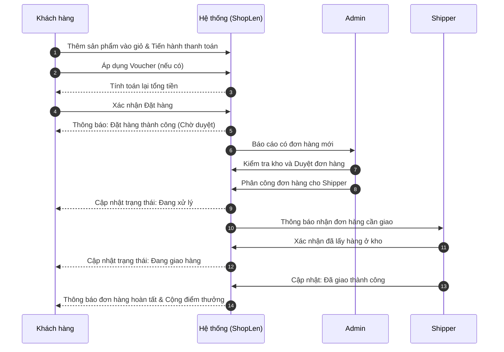
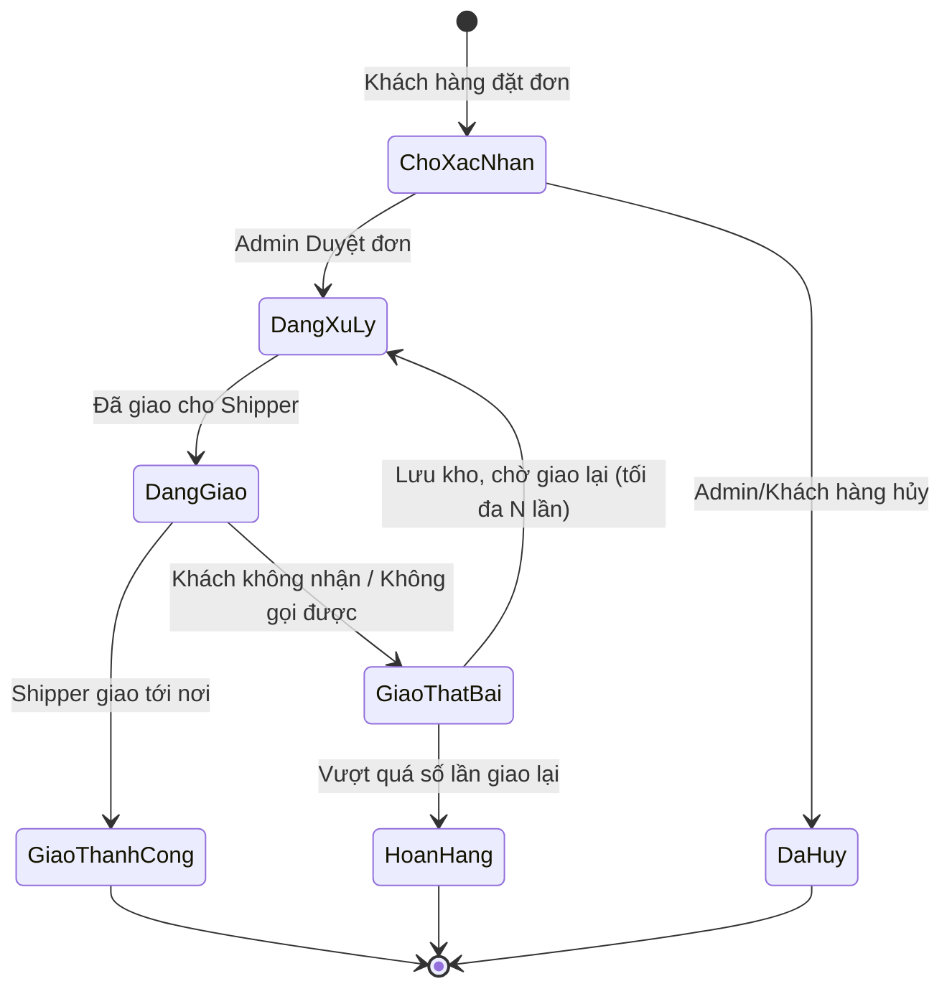

# ShopLen - Hệ Thống Cửa Hàng & Cộng Đồng Đan Len (ShopLenReact)

## 1. Giới thiệu sản phẩm
**ShopLen** là một nền tảng thương mại điện tử chuyên biệt kết hợp cộng đồng dành riêng cho những người yêu thích đồ handmade và đan móc len. 
Hệ thống không chỉ dừng lại ở việc bán lẻ các thành phẩm từ len (áo len, túi xách, móc khóa, gấu bông...) và nguyên phụ liệu đan len, mà còn cung cấp nền tảng quản lý tổ chức các buổi Workshop chia sẻ kỹ năng. 

ShopLen cung cấp trải nghiệm hoàn thiện cho 3 nhóm đối tượng:
- **Khách hàng (User):** Trải nghiệm mua sắm mượt mà, tích điểm đổi quà và tham gia cộng đồng.
- **Quản trị viên (Admin):** Quản lý vận hành toàn diện từ sản phẩm, kho bãi, nhân sự đến các chiến dịch marketing.
- **Nhân viên giao hàng (Shipper):** Quản lý và theo dõi quá trình giao nhận hàng hóa.

Hệ thống được xây dựng với các công nghệ Frontend hiện đại: **React, Redux Toolkit, Tailwind CSS, Framer Motion, Recharts và Ant Design**.

---

## 2. Danh sách các chức năng

### Hệ thống Khách hàng (User)
- Đăng ký / Đăng nhập / Xác thực người dùng
- Mua sắm (Cửa hàng - Shop, Tìm kiếm, Lọc sản phẩm)
- Giỏ hàng (Cart) và Thanh toán (Billing)
- Quản lý hồ sơ cá nhân (User Profile)
- Đăng ký và theo dõi tham gia Workshop
- Danh sách sản phẩm yêu thích (Wishlist)
- Ví Voucher và Đổi điểm thưởng (Vouchers & Exchange Point)

### Hệ thống Quản trị (Admin)
- Bảng điều khiển thống kê (Dashboard)
- Quản lý Tài khoản (Account)
- Quản lý Danh mục (Category) & Sản phẩm (Products)
- Quản lý Đơn hàng (Order)
- Quản lý Kho hàng (Stock)
- Quản lý Khuyến mãi (Promotion) & Voucher
- Quản lý Đổi điểm thưởng (Exchange Point)
- Quản lý Workshop
- Quản lý Đội ngũ Shipper

### Hệ thống Giao hàng (Shipper)
- Hồ sơ nhân viên giao hàng (Shipper Profile)
- Tiếp nhận đơn hàng & Cập nhật trạng thái giao hàng

---

## 3. Điểm mạnh và Điểm yếu

### Điểm mạnh:
- **Hệ sinh thái toàn diện:** Không chỉ bán hàng mà còn có Workshop và tích điểm đổi quà, tạo ra một vòng lặp giữ chân khách hàng (Customer Retention) cực tốt.
- **UI/UX Hiện đại:** Ứng dụng Framer Motion và Lottie để tạo các vi tương tác (micro-interactions), Ant Design cho form nghiệp vụ phức tạp.
- **Kiến trúc rõ ràng:** Phân tách rạch ròi 3 luồng người dùng (User, Admin, Shipper) giúp hệ thống dễ dàng bảo trì và scale.
- **Hiệu suất & Thống kê tốt:** Tích hợp biểu đồ trực quan (Recharts) giúp Admin ra quyết định kinh doanh dựa trên dữ liệu.

### Điểm yếu:
- **Nghiệp vụ phức tạp:** Đòi hỏi backend phải xử lý nhiều luồng dữ liệu song song (vừa trừ kho, vừa tính điểm, vừa quản lý trạng thái giao hàng).
- **Phụ thuộc vào quản lý vật lý:** Các hoạt động Workshop offline và quản lý kho hàng thủ công đòi hỏi nhân sự vận hành thực tế phải làm việc ăn khớp với hệ thống.
- **Rủi ro giao hàng:** Quản lý Shipper nội bộ cần quy trình đối soát tiền thu hộ (COD) nghiêm ngặt.

---

## 4. Mô tả các Use Case (Use Case Descriptions)

| Use Case | Tác nhân | Mô tả |
|----------|----------|-------|
| **UC1 - Mua hàng & Thanh toán** | Khách hàng (User) | Người dùng tìm sản phẩm, thêm vào giỏ hàng, áp dụng Voucher, nhập thông tin địa chỉ và xác nhận đặt hàng. |
| **UC2 - Quản lý Voucher & Đổi điểm** | Khách hàng (User) | Người dùng truy cập trang cá nhân, xem số điểm (Exchange Point) hiện có và bấm đổi lấy các Voucher tương ứng. |
| **UC3 - Đăng ký Workshop** | Khách hàng (User) | Người dùng xem danh sách Workshop sắp tổ chức, chọn chỗ, xác nhận tham gia và thanh toán vé (nếu có). |
| **UC4 - Xử lý Đơn hàng** | Quản trị viên (Admin) | Admin nhận thông báo đơn hàng mới, kiểm tra tồn kho, duyệt đơn và phân công cho Shipper. |
| **UC5 - Xem báo cáo thống kê** | Quản trị viên (Admin) | Admin truy cập Dashboard để xem biểu đồ doanh thu, số lượng đơn hàng và sản phẩm bán chạy. |
| **UC6 - Giao hàng** | Shipper | Shipper tiếp nhận đơn được phân công, lấy hàng, đi giao và cập nhật trạng thái "Thành công" hoặc "Thất bại" lên hệ thống. |

---

## 5. Sơ đồ tuần tự (Sequence Diagram)

Sơ đồ mô tả luồng **Đặt hàng và Giao hàng** cốt lõi của hệ thống:

---

## 6. Sơ đồ trạng thái (State Diagram)

Sơ đồ mô tả **Vòng đời của một Đơn hàng (Order Lifecycle)**:

---

## 7. Mô tả chi tiết từng tính năng

### 7.1. Cụm tính năng Khách hàng (User Features)
- **Shop & Lọc sản phẩm:** Trang hiển thị danh sách sản phẩm. Cho phép người dùng lọc theo loại len, loại thành phẩm, lọc theo giá hoặc tìm kiếm theo tên.
- **Cart & Billing (Giỏ hàng & Thanh toán):** Lưu trữ tạm thời các mặt hàng khách muốn mua. Trang thanh toán tính toán phí ship, áp dụng mã giảm giá trực tiếp và xác nhận phương thức thanh toán.
- **User Profile & Vouchers:** Nơi lưu trữ thông tin cá nhân. Khách hàng có thể theo dõi lịch sử đơn hàng, quản lý danh sách yêu thích (Wishlist) và xem các Voucher đang sở hữu.
- **Workshop:** Một không gian đặc biệt hiển thị các sự kiện đan len. Khách hàng có thể đọc thông tin hướng dẫn viên, thời gian, địa điểm và đăng ký giữ chỗ.
- **Đổi điểm (Exchange Point):** Mỗi đơn hàng hoàn tất sẽ mang lại một số điểm nhất định. Khách hàng sử dụng điểm này để đổi các phần quà vật lý hoặc Voucher giảm giá.

### 7.2. Cụm tính năng Quản trị (Admin Features)
- **Manager Dashboard:** Trang tổng quan hiển thị các biểu đồ (doanh thu theo tháng/tuần, tỷ lệ đơn hàng thành công, số lượng user mới) giúp ban quản trị nắm bắt tình hình kinh doanh.
- **Manager Products & Category:** Cho phép thêm, sửa, xóa sản phẩm. Upload hình ảnh, chỉnh sửa mô tả, gắn thẻ (tag) cho sản phẩm thuộc các danh mục khác nhau.
- **Manager Order:** Liệt kê toàn bộ đơn hàng trong hệ thống. Admin có thể xem chi tiết người mua, lịch sử thay đổi trạng thái đơn và thao tác duyệt/hủy đơn.
- **Manager Stock (Kho hàng):** Quản lý số lượng tồn kho của nguyên liệu len và thành phẩm. Phát cảnh báo khi sản phẩm sắp hết hạn mức an toàn.
- **Manager Promotion & Voucher:** Nơi Admin tạo các chiến dịch khuyến mãi (ví dụ: Giảm giá 20% dịp Giáng sinh) và sinh ra các mã Voucher để phát cho khách hàng.
- **Manager Workshop:** Tạo mới các sự kiện Workshop, quản lý danh sách học viên đăng ký, giới hạn số lượng người tham gia.
- **Manager Shipper:** Quản lý thông tin và hiệu suất của nhân viên giao hàng nội bộ.

### 7.3. Cụm tính năng Giao hàng (Shipper Features)
- **Shipper Profile:** Trang cá nhân của nhân viên giao hàng, hiển thị thông tin và tổng số đơn hàng đã giao thành công.
- **Tiếp nhận & Cập nhật đơn:** Danh sách các đơn hàng được Admin phân công. Shipper có trách nhiệm gọi điện cho khách, đi giao và bấm nút chuyển trạng thái (Đang giao, Thành công, Thất bại) ngay trên thiết bị di động/tablet của mình.